# UMLアーキテクチャドキュメント - 伊勢節カラオケアプリ

## 目次
- [メインアプリケーションアーキテクチャ](#main-application-architecture)
- [MyAppウィジェット階層](#myapp-widget-hierarchy)
- [クラス図](#class-diagrams)
- [依存関係図](#dependency-diagrams)
- [アーキテクチャレイヤー図](#architecture-layers)

## UML保守ガイドライン

### 更新頻度とタイミング
- **必須更新**: 新しいクラス・インターフェース・サービスの追加時
- **必須更新**: 既存クラスの大幅な変更（メソッド追加・削除、責任の変更）時
- **推奨更新**: メジャーリファクタリング完了時
- **推奨更新**: 新機能実装完了時

### 更新手順
1. **変更内容の特定**: どのコンポーネントが変更されたかを確認
2. **関連図の選択**: 変更に関連するUML図を特定
3. **図の更新**: Mermaid記法で該当箇所を修正
4. **一貫性確認**: 他の図との整合性をチェック
5. **ドキュメント更新**: 変更履歴の記録

### 更新チェックリスト
- [ ] 新しいクラス/インターフェースが追加された際の図への反映
- [ ] 依存関係の変更がすべての関連図に反映されている
- [ ] レイヤー間の境界が正しく表現されている
- [ ] メソッドシグネチャの重要な変更が反映されている
- [ ] パッケージ構造の変更が反映されている

### UML図の種類と更新対象
- **クラス図**: 新しいクラス・インターフェース・重要なメソッドの変更
- **依存関係図**: サービス間の関係変更・新しい依存の追加
- **レイヤー図**: アーキテクチャの構造変更・新しいレイヤーの追加
- **フロー図**: ビジネスロジックの大幅な変更・新しいワークフローの追加

### 更新の責任者
- **コード変更者**: 変更内容をUMLに反映する責任
- **レビュアー**: UMLの整合性と正確性を確認する責任

## 設計原則ガイドライン

### SOLID原則の適用

#### Single Responsibility Principle (SRP) - 単一責任の原則
- **ガイドライン**: 各クラスは1つの責任のみを持つ
- **実装**: サービスクラスを機能別に分割（AudioProcessingService、PitchDetectionService等）
- **UML反映**: クラス図で各クラスの責任を明確に記述

#### Open/Closed Principle (OCP) - 開放閉鎖の原則  
- **ガイドライン**: 拡張に対しては開放、修正に対しては閉鎖
- **実装**: インターフェースベースの設計、プラグイン可能なアーキテクチャ
- **UML反映**: インターフェース継承関係を明示

#### Liskov Substitution Principle (LSP) - リスコフの置換原則
- **ガイドライン**: 派生クラスは基底クラスと置換可能
- **実装**: インターフェース実装時の契約遵守
- **UML反映**: 継承関係の制約条件を明記

#### Interface Segregation Principle (ISP) - インターフェース分離の原則
- **ガイドライン**: クライアントが使用しないメソッドに依存させない
- **実装**: 細分化されたインターフェース設計
- **UML反映**: インターフェース依存関係を最小化

#### Dependency Inversion Principle (DIP) - 依存性逆転の原則
- **ガイドライン**: 抽象に依存し、具象に依存しない
- **実装**: Service Locatorパターン、依存性注入
- **UML反映**: 依存関係の方向を抽象化レイヤーへ

### その他の設計原則

#### KISS (Keep It Simple, Stupid) - シンプル設計の原則
- **ガイドライン**: 最もシンプルな解決策を選択
- **実装**: 複雑な処理の分割、明確な命名規則
- **UML反映**: クラス関係の複雑さを最小化

#### YAGNI (You Aren't Gonna Need It) - 必要最小限の原則
- **ガイドライン**: 現在必要でない機能は実装しない
- **実装**: 段階的な機能追加、将来拡張可能な設計
- **UML反映**: 現在の要件のみを反映

#### DRY (Don't Repeat Yourself) - 重複排除の原則
- **ガイドライン**: コードの重複を避ける
- **実装**: 共通機能の抽象化、ユーティリティクラスの活用
- **UML反映**: 共通機能を基底クラスやミックスインで表現

### リファクタリング指針

1. **コード重複の特定と統合**
2. **責任の分離と単一責任の確保**
3. **インターフェースの最適化**
4. **依存関係の整理と抽象化**
5. **複雑な処理の単純化**

---

## Table of Contents
1. [System Overview](#system-overview)
2. [Class Diagrams](#class-diagrams)
3. [Sequence Diagrams](#sequence-diagrams)
4. [Component Diagrams](#component-diagrams)
5. [Data Flow Diagrams](#data-flow-diagrams)
6. [State Diagrams](#state-diagrams)

## System Overview

### High-Level Architecture

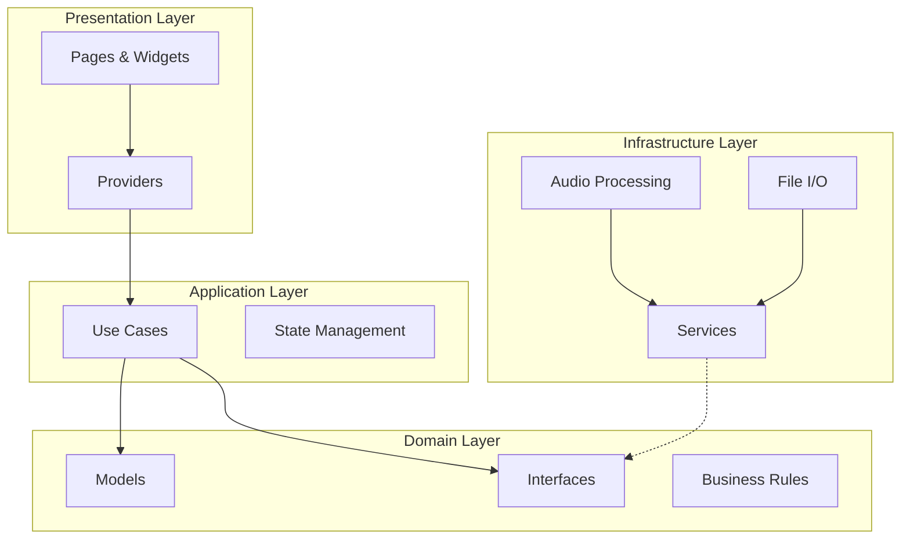

## メインアプリケーションアーキテクチャ {#main-application-architecture}

### アプリケーション全体構成図

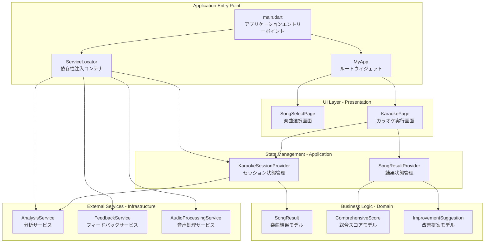

### アプリケーション起動フロー

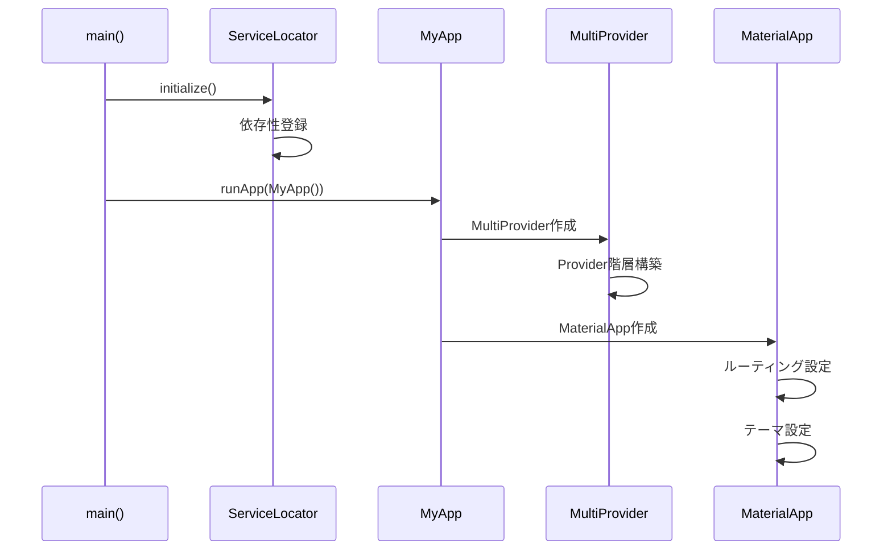

## MyAppウィジェット階層 {#myapp-widget-hierarchy}

### ウィジェット構成図

```mermaid
graph TB
    subgraph "MyApp Widget Hierarchy"
        MA[MyApp<br/>ルートウィジェット]
        MP[MultiProvider<br/>Provider階層管理]
        MAT[MaterialApp<br/>マテリアルデザイン適用]
        
        subgraph "Providers"
            KSP[KaraokeSessionProvider<br/>カラオケセッション状態]
            SRP[SongResultProvider<br/>結果表示状態]
        end
        
        subgraph "Routes"
            HOME[/ - SongSelectPage<br/>楽曲選択画面]
            KARAOKE[/karaoke - KaraokePage<br/>カラオケ実行画面]
        end
    end
    
    MA --> MP
    MP --> KSP
    MP --> SRP
    MP --> MAT
    MAT --> HOME
    MAT --> KARAOKE
```

### ナビゲーションフロー

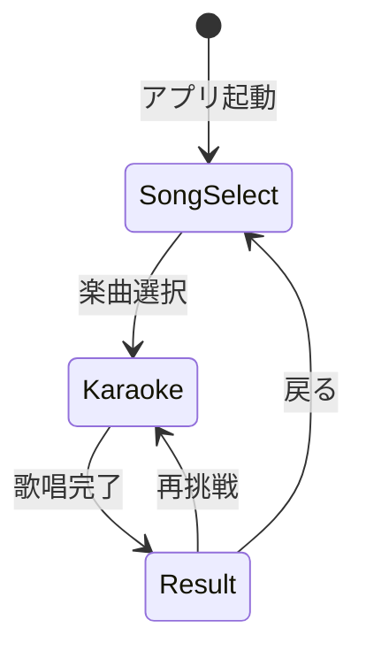

## クラス図 {#class-diagrams}

### 1. ドメインモデル

```mermaid
classDiagram
    class SongResult {
        +String songTitle
        +double totalScore
        +String scoreLevel
        +DateTime recordedAt
        +ScoreBreakdown scoreBreakdown
        +PitchAnalysis pitchAnalysis
        +StabilityAnalysis stabilityAnalysis
        +List~String~ feedback
        +Map~String, dynamic~ toJson()
        +SongResult fromJson(json)
    }
    
    class ScoreBreakdown {
        +double pitchAccuracyScore
        +double stabilityScore
        +double timingScore
        +double pitchAccuracy
        +double stability
        +double timing
        +double pitchWeight
        +double stabilityWeight
        +double timingWeight
        +double calculateWeightedTotal()
    }
    
    class ComprehensiveScore {
        +double pitchAccuracy
        +double stability
        +double timing
        +double overall
        +ScoreLevel level
        +bool isExcellent()
        +bool isGood()
        +bool needsImprovement()
    }
    
    class ImprovementSuggestion {
        +String category
        +String title
        +String description
        +int priority
        +String specificAdvice
        +Map~String, dynamic~ toJson()
        +ImprovementSuggestion fromJson(json)
    }
    
    class AudioAnalysisResult {
        +List~double~ detectedPitches
        +List~double~ confidenceScores
        +double averagePitch
        +double pitchStability
        +Duration totalDuration
        +bool isValid()
    }
    
    class PitchComparisonResult {
        +List~double~ pitchDifferences
        +double averageDifference
        +double maxDifference
        +double accuracyPercentage
        +int totalComparisons
        +PitchAccuracyLevel accuracyLevel
    }
    
    SongResult ||--|| ScoreBreakdown
    SongResult ||--o{ ImprovementSuggestion
    SongResult ||--|| AudioAnalysisResult
    SongResult ||--|| PitchComparisonResult
    ComprehensiveScore ||--|| ScoreBreakdown
```

### 2. Service Layer Interfaces

```mermaid
classDiagram
    class IAudioProcessingService {
        <<interface>>
        +Future~List~double~~ extractPitchFromAudio(filePath)
        +Future~Uint8List~ extractPcmFromWav(filePath)
        +bool isWavFile(filePath)
        +Future~bool~ validateAudioFile(filePath)
    }
    
    class IPitchDetectionService {
        <<interface>>
        +Future~List~double~~ extractPitchFromAudio(filePath)
        +Future~double?~ detectPitchFromPcm(pcmData)
        +bool isValidPitch(pitch)
        +double normalizeFrequency(frequency)
    }
    
    class IScoringService {
        <<interface>>
        +ComprehensiveScore calculateComprehensiveScore(reference, recorded)
        +double calculatePitchAccuracy(reference, recorded)
        +double calculateStability(pitches)
        +double calculateTiming(reference, recorded)
        +String getScoreRank(score)
        +String getScoreComment(score)
    }
    
    class IAnalysisService {
        <<interface>>
        +PitchAnalysis analyzePitchAccuracy(reference, recorded)
        +StabilityAnalysis analyzeStability(pitches)
        +TimingAnalysis analyzeTiming(reference, recorded)
        +AudioAnalysisResult analyzeAudioQuality(audioData)
    }
    
    class IFeedbackService {
        <<interface>>
        +List~String~ generateBasicFeedback(score)
        +List~ImprovementSuggestion~ generateImprovementSuggestions(score)
        +Map~String, double~ suggestNextGoals(songResult)
        +String getEncouragementMessage(score)
    }
    
    class ICacheService {
        <<interface>>
        +Future~T?~ get~T~(key)
        +Future~void~ set~T~(key, value)
        +Future~void~ remove(key)
        +Future~void~ clear()
        +bool exists(key)
    }
```

### 3. Service Implementations

```mermaid
classDiagram
    class AudioProcessingService {
        -PitchDetectorDart _pitchDetector
        -DebugLogger _logger
        +Future~List~double~~ extractPitchFromAudio(filePath)
        +Future~Uint8List~ extractPcmFromWav(filePath)
        +bool isWavFile(filePath)
        +Future~bool~ validateAudioFile(filePath)
        -Future~Uint8List~ _readWavFile(filePath)
        -List~double~ _extractPitchesFromPcm(pcmData)
    }
    
    class PitchDetectionService {
        -PitchDetectorDart _detector
        -AudioProcessingService _audioService
        +Future~List~double~~ extractPitchFromAudio(filePath)
        +Future~double?~ detectPitchFromPcm(pcmData)
        +bool isValidPitch(pitch)
        +double normalizeFrequency(frequency)
        -double _filterNoise(pitch)
        -bool _isInValidRange(pitch)
    }
    
    class ScoringService {
        +ComprehensiveScore calculateComprehensiveScore(reference, recorded)
        +double calculatePitchAccuracy(reference, recorded)
        +double calculateStability(pitches)
        +double calculateTiming(reference, recorded)
        +String getScoreRank(score)
        +String getScoreComment(score)
        -double _calculateWeightedScore(scores, weights)
        -ScoreLevel _determineScoreLevel(score)
    }
    
    class AnalysisService {
        -ScoringService _scoringService
        +PitchAnalysis analyzePitchAccuracy(reference, recorded)
        +StabilityAnalysis analyzeStability(pitches)
        +TimingAnalysis analyzeTiming(reference, recorded)
        +AudioAnalysisResult analyzeAudioQuality(audioData)
        -double _calculateVariance(values)
        -List~double~ _smoothPitchData(pitches)
    }
    
    class FeedbackService {
        +List~String~ generateBasicFeedback(score)
        +List~ImprovementSuggestion~ generateImprovementSuggestions(score)
        +Map~String, double~ suggestNextGoals(songResult)
        +String getEncouragementMessage(score)
        -String _generatePitchFeedback(accuracy)
        -String _generateStabilityFeedback(stability)
        -String _generateTimingFeedback(timing)
    }
    
    AudioProcessingService ..|> IAudioProcessingService
    PitchDetectionService ..|> IPitchDetectionService
    ScoringService ..|> IScoringService
    AnalysisService ..|> IAnalysisService
    FeedbackService ..|> IFeedbackService
```

### 4. Provider Layer

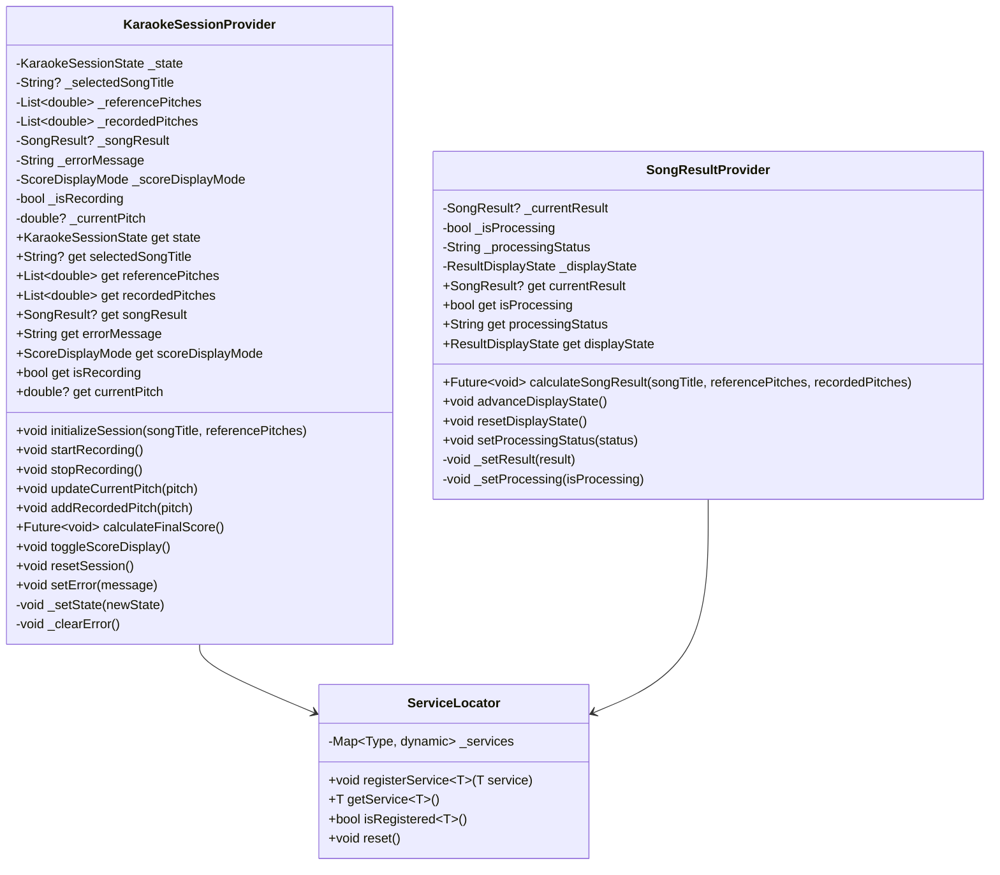

### 5. Widget Layer

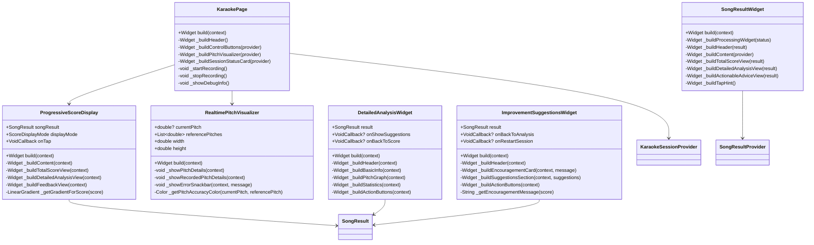

## Sequence Diagrams

### 1. Karaoke Session Flow

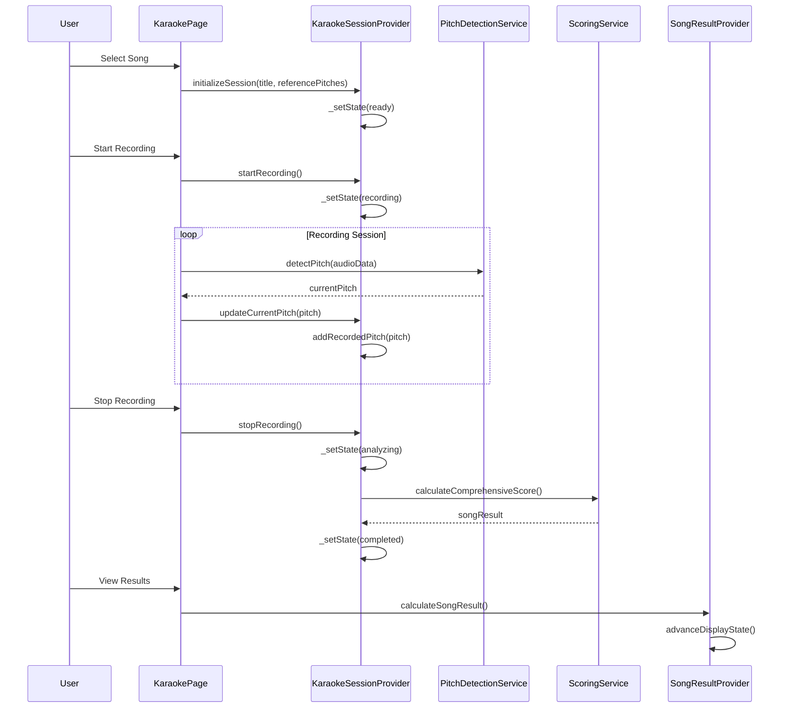

### 2. Score Calculation Flow

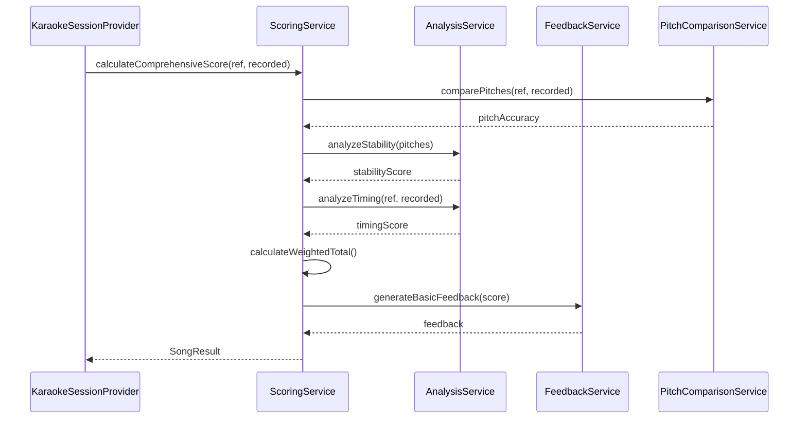

### 3. Progressive Display Flow

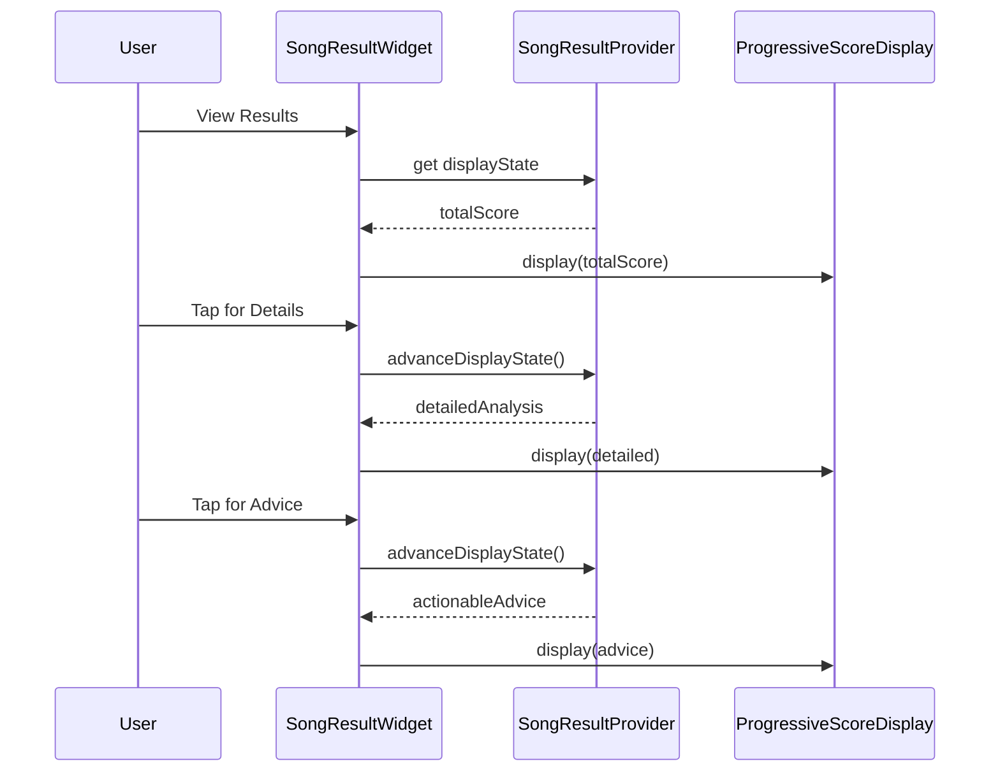

## Component Diagrams

### 1. Service Component Structure

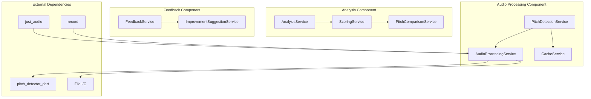

### 2. Provider Component Structure

```mermaid
graph TB
    subgraph "State Management"
        KSP[KaraokeSessionProvider]
        SRP[SongResultProvider]
        SL[ServiceLocator]
    end
    
    subgraph "UI Components"
        KP[KaraokePage]
        PSD[ProgressiveScoreDisplay]
        RPV[RealtimePitchVisualizer]
        SRW[SongResultWidget]
    end
    
    subgraph "Services"
        Services[Service Layer]
    end
    
    KP --> KSP
    KP --> RPV
    KP --> PSD
    SRW --> SRP
    KSP --> SL
    SRP --> SL
    SL --> Services
```

## Data Flow Diagrams

### 1. Audio Processing Data Flow

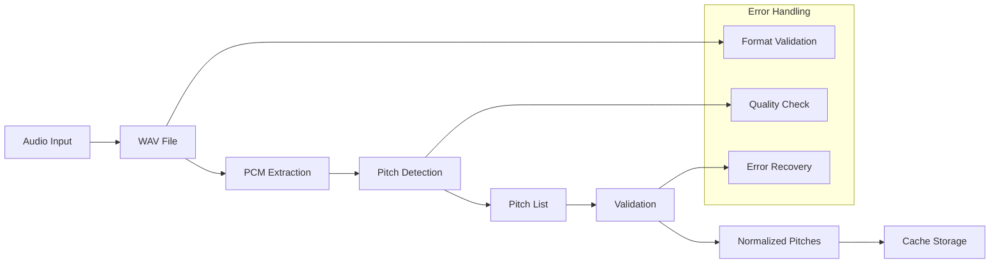

### 2. Score Calculation Data Flow

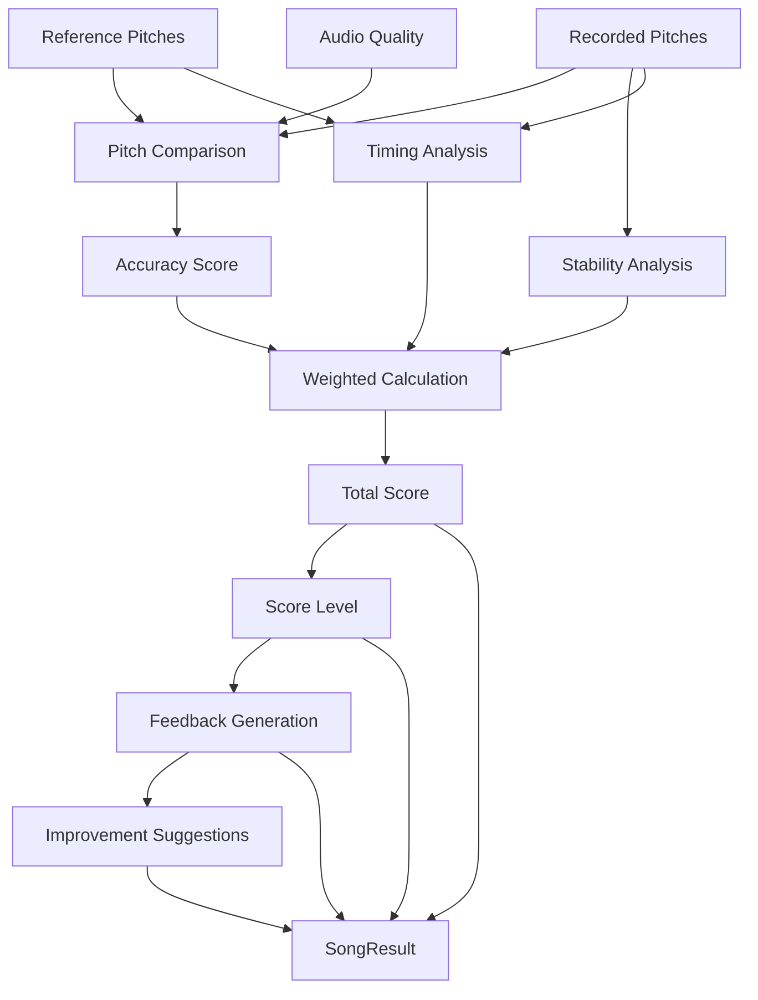

## State Diagrams

### 1. Karaoke Session State

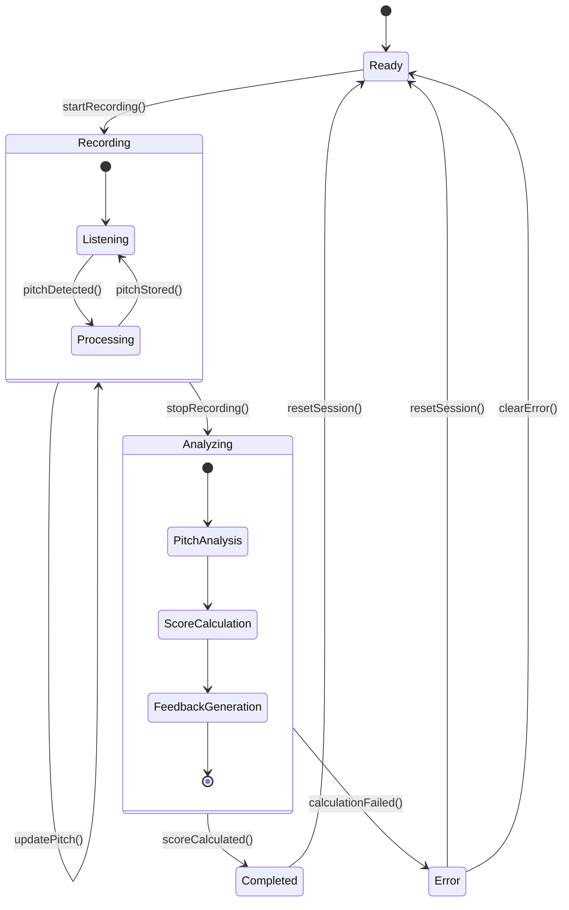

### 2. Display State Progression

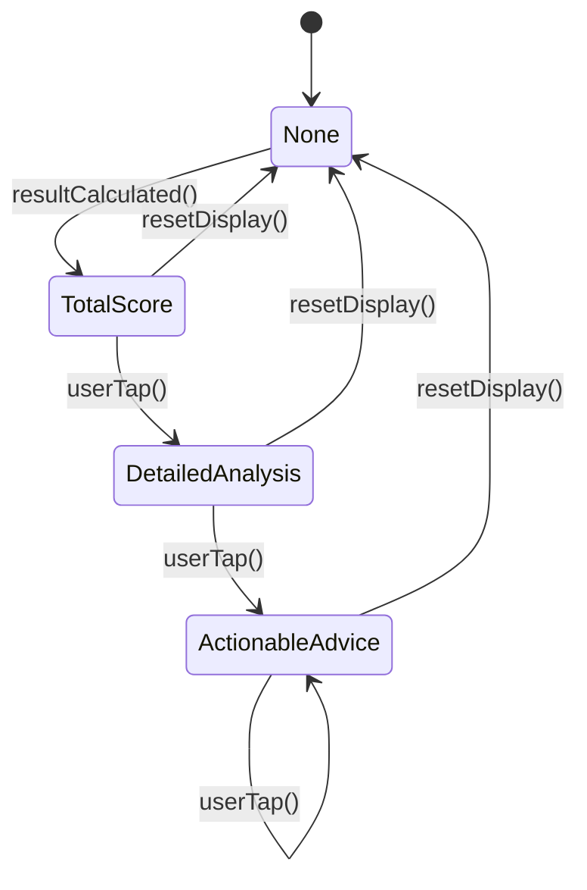

## Key Architectural Patterns

### 1. Dependency Inversion
- Services depend on interfaces, not implementations
- Easy to mock for testing
- Flexible service replacement

### 2. Single Responsibility
- Each service has one clear purpose
- Widgets focus only on presentation
- Providers manage state only

### 3. Observer Pattern
- Providers notify listeners of state changes
- UI automatically updates when state changes
- Loose coupling between components

### 4. Factory Pattern
- ServiceLocator creates and manages service instances
- Centralized dependency management
- Easy configuration and testing

### 5. Strategy Pattern
- Different scoring algorithms can be plugged in
- Flexible feedback generation strategies
- Configurable analysis methods

## Performance Considerations

### 1. Audio Processing
- Efficient PCM data handling
- Minimal memory allocation
- Background processing where possible

### 2. State Management
- Selective notification of listeners
- Batch updates when possible
- Proper disposal of resources

### 3. UI Rendering
- Lazy loading of heavy widgets
- Efficient list rendering
- Optimized rebuild patterns

## Future Extension Points

### 1. Additional Audio Formats
- Interface allows easy format addition
- Pluggable audio processors
- Format-specific optimizations

### 2. Advanced Analysis
- Machine learning integration
- Cloud-based processing
- Real-time analysis improvements

### 3. Multi-language Support
- Internationalization framework
- Locale-specific feedback
- Cultural adaptation of scoring

This UML documentation provides a comprehensive view of the system architecture and serves as a foundation for the refactoring process.
