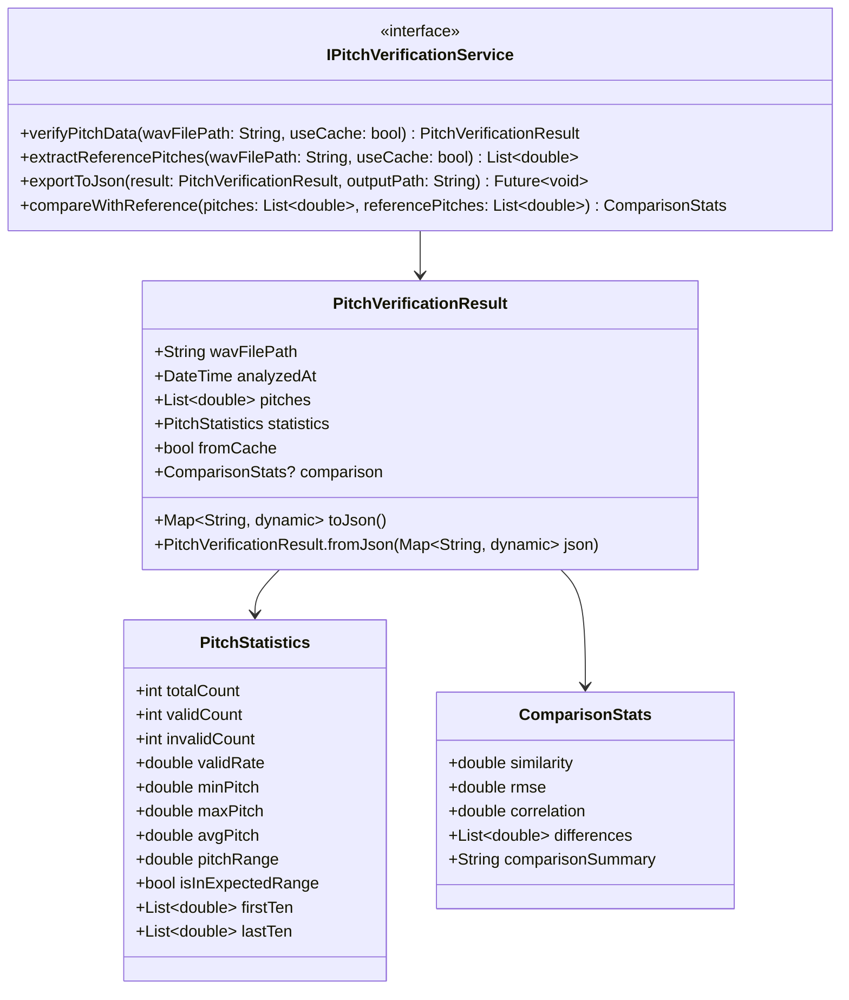
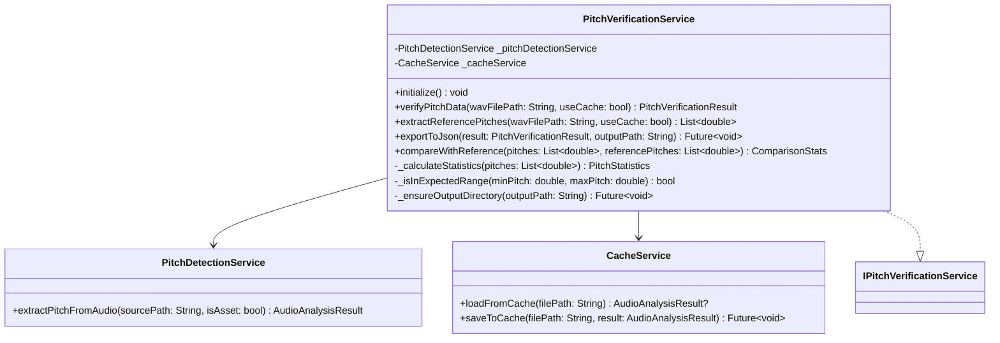
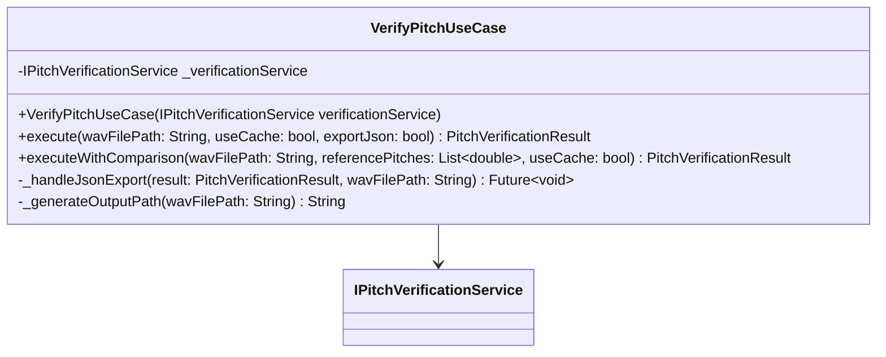
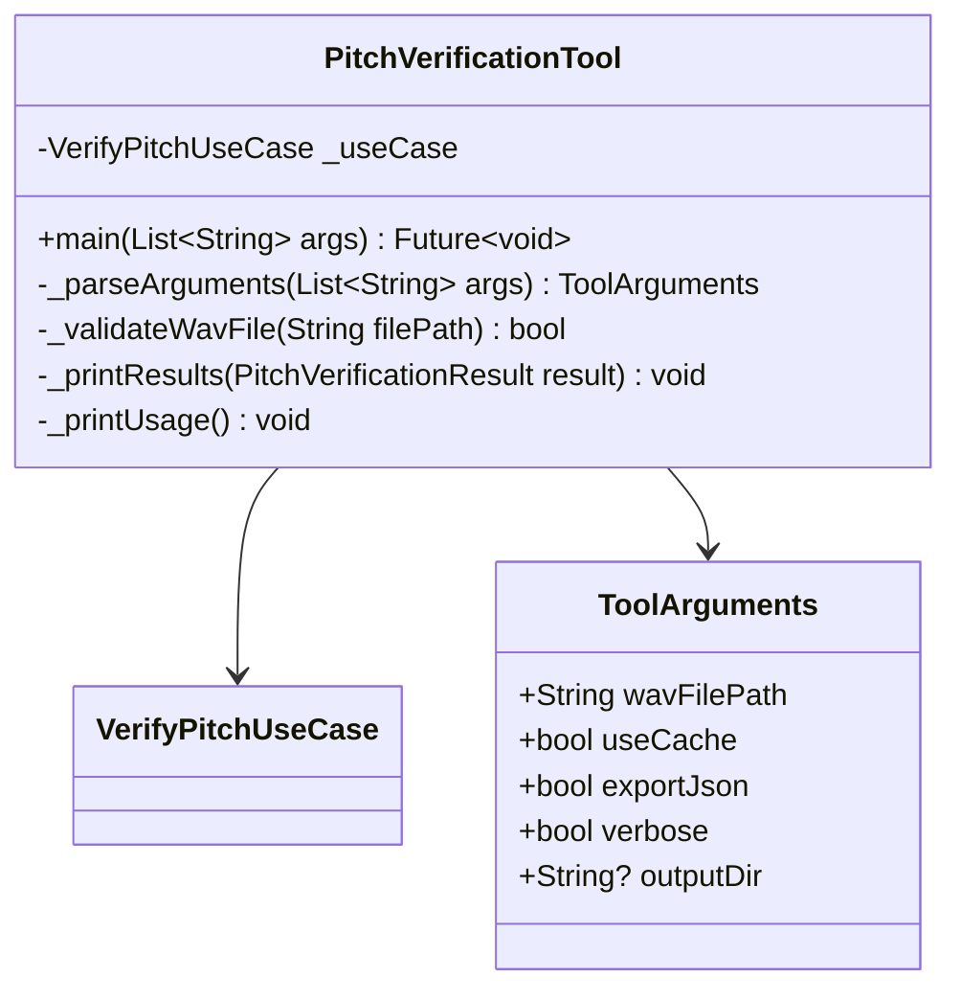
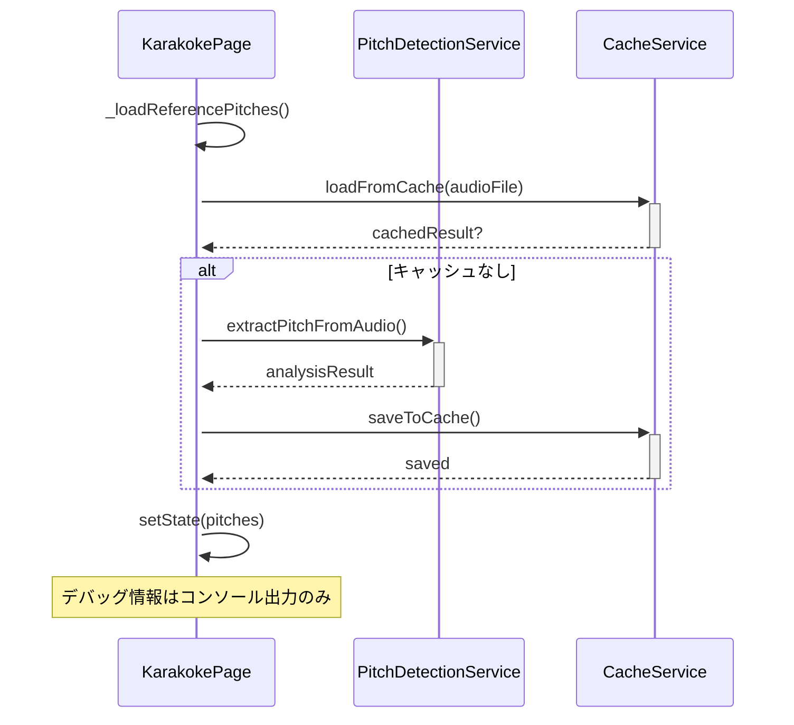
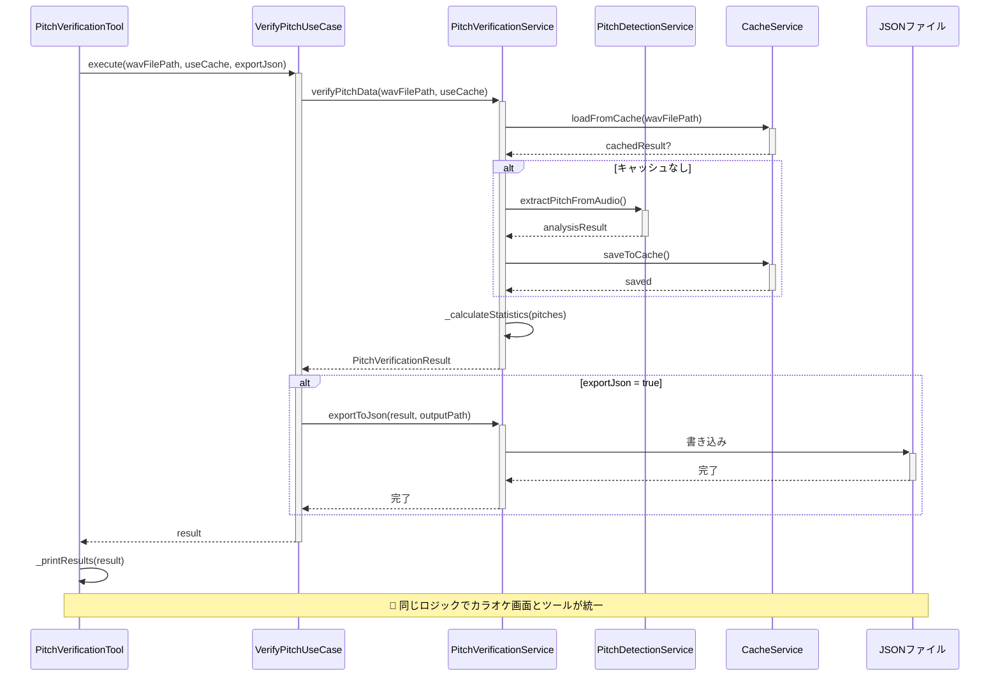
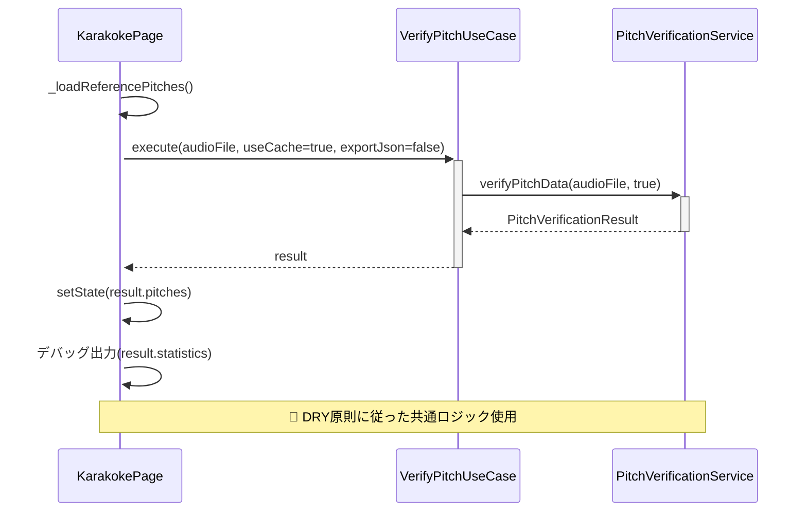

# 🏗️ Isebushi Karaoke - UMLアーキテクチャドキュメント

> **更新ポリシー**: 新機能追加・修正時は必ずUML図を更新してください。

## 📋 ドキュメント情報
- **作成日**: 2025年7月31日
- **最終更新**: 2025年7月31日
- **対象ブランチ**: copilot/fix-e14957fd-f22b-4af8-9758-246edf71f633
- **更新理由**: 基準ピッチ検証ツール強化対応

---

## 🎯 現在のクリーンアーキテクチャ概要

```mermaid
graph TB
    subgraph "🎨 Presentation Layer"
        KP[KarakokePage]
        SSP[SongSelectPage]
        PVW[PitchVisualizationWidget]
        RSW[RealtimeScoreWidget]
    end
    
    subgraph "💼 Application Layer"
        KSP[KaraokeSessionProvider]
        SRP[SongResultProvider]
        UC[UseCases]
    end
    
    subgraph "🏛️ Domain Layer"
        subgraph "Interfaces"
            IPDS[IPitchDetectionService]
            IAS[IAnalysisService]
            ISS[IScoringService]
            ICS[ICacheService]
            IAPS[IAudioProcessingService]
            IFS[IFeedbackService]
        end
        
        subgraph "Models"
            AAR[AudioAnalysisResult]
            AD[AudioData]
            CS[ComprehensiveScore]
            IS[ImprovementSuggestion]
            PCR[PitchComparisonResult]
            SM[ScoringModels]
            SR[SongResult]
        end
    end
    
    subgraph "🔧 Infrastructure Layer"
        PDS[PitchDetectionService]
        AS[AnalysisService]
        SS[ScoringService]
        CacheS[CacheService]
        APS[AudioProcessingService]
        FS[FeedbackService]
        ISS_IMPL[ImprovementSuggestionService]
        PCS[PitchComparisonService]
        WP[WavProcessor]
        WV[WavValidator]
    end
    
    subgraph "🛠️ Tools Layer"
        TRP[TestReferencePitch]
        TPD[TestPitchDetection]
    end
    
    %% Dependencies
    KP --> KSP
    KP --> PDS
    SSP --> CacheS
    
    KSP --> IPDS
    SRP --> ISS
    
    PDS -.-> IPDS
    AS -.-> IAS
    SS -.-> ISS
    CacheS -.-> ICS
    APS -.-> IAPS
    FS -.-> IFS
    
    PDS --> AAR
    AS --> PCR
    SS --> CS
    
    TRP --> PDS
    TPD --> PDS
    
    classDef presentationStyle fill:#e1f5fe
    classDef applicationStyle fill:#f3e5f5
    classDef domainStyle fill:#e8f5e8
    classDef infrastructureStyle fill:#fff3e0
    classDef toolsStyle fill:#fce4ec
    
    class KP,SSP,PVW,RSW presentationStyle
    class KSP,SRP,UC applicationStyle
    class IPDS,IAS,ISS,ICS,IAPS,IFS,AAR,AD,CS,IS,PCR,SM,SR domainStyle
    class PDS,AS,SS,CacheS,APS,FS,ISS_IMPL,PCS,WP,WV infrastructureStyle
    class TRP,TPD toolsStyle
```



---

## 🎯 基準ピッチ検証ツール強化 - 新アーキテクチャ設計

### 📐 拡張後のクリーンアーキテクチャ

```mermaid
graph TB
    subgraph "🎨 Presentation Layer"
        KP[KarakokePage<br/>_loadReferencePitches]
        SSP[SongSelectPage]
        PVW[PitchVisualizationWidget]
        RSW[RealtimeScoreWidget]
    end
    
    subgraph "💼 Application Layer"
        KSP[KaraokeSessionProvider]
        SRP[SongResultProvider]
        VPU[VerifyPitchUseCase<br/>🆕]
    end
    
    subgraph "🏛️ Domain Layer"
        subgraph "Interfaces"
            IPDS[IPitchDetectionService]
            IAS[IAnalysisService]
            ISS[IScoringService]
            ICS[ICacheService]
            IAPS[IAudioProcessingService]
            IFS[IFeedbackService]
            IPVS[IPitchVerificationService<br/>🆕]
        end
        
        subgraph "Models"
            AAR[AudioAnalysisResult]
            AD[AudioData]
            CS[ComprehensiveScore]
            IS[ImprovementSuggestion]
            PCR[PitchComparisonResult]
            SM[ScoringModels]
            SR[SongResult]
            PVR[PitchVerificationResult<br/>🆕]
        end
    end
    
    subgraph "🔧 Infrastructure Layer"
        PDS[PitchDetectionService]
        AS[AnalysisService]
        SS[ScoringService]
        CacheS[CacheService]
        APS[AudioProcessingService]
        FS[FeedbackService]
        ISS_IMPL[ImprovementSuggestionService]
        PCS[PitchComparisonService]
        WP[WavProcessor]
        WV[WavValidator]
        PVS[PitchVerificationService<br/>🆕]
    end
    
    subgraph "🛠️ Tools Layer"
        TRP[TestReferencePitch]
        TPD[TestPitchDetection]
        PVT[PitchVerificationTool<br/>🆕]
    end
    
    subgraph "📁 Output"
        JSON[verification_results/<br/>*.json<br/>🆕]
    end
    
    %% 新しい依存関係
    KP --> VPU
    VPU --> IPVS
    PVS -.-> IPVS
    PVS --> PVR
    PVS --> PDS
    PVS --> CacheS
    
    PVT --> VPU
    PVT --> JSON
    
    %% 既存の依存関係
    KP --> KSP
    KP --> PDS
    SSP --> CacheS
    
    KSP --> IPDS
    SRP --> ISS
    
    PDS -.-> IPDS
    AS -.-> IAS
    SS -.-> ISS
    CacheS -.-> ICS
    APS -.-> IAPS
    FS -.-> IFS
    
    PDS --> AAR
    AS --> PCR
    SS --> CS
    
    TRP --> PDS
    TPD --> PDS
    
    classDef presentationStyle fill:#e1f5fe
    classDef applicationStyle fill:#f3e5f5
    classDef domainStyle fill:#e8f5e8
    classDef infrastructureStyle fill:#fff3e0
    classDef toolsStyle fill:#fce4ec
    classDef newStyle fill:#ffeb3b,stroke:#f57f17,stroke-width:3px
    classDef outputStyle fill:#f1f8e9
    
    class KP,SSP,PVW,RSW presentationStyle
    class KSP,SRP applicationStyle
    class IPDS,IAS,ISS,ICS,IAPS,IFS,AAR,AD,CS,IS,PCR,SM,SR domainStyle
    class PDS,AS,SS,CacheS,APS,FS,ISS_IMPL,PCS,WP,WV infrastructureStyle
    class TRP,TPD toolsStyle
    class JSON outputStyle
    
    %% 新規追加要素
    class VPU,IPVS,PVR,PVS,PVT newStyle
```



---

## 🔍 基準ピッチ検証ツール - クラス詳細設計

### 🏛️ Domain Layer

#### IPitchVerificationService (Interface)



### 🔧 Infrastructure Layer

#### PitchVerificationService (Implementation)



### 💼 Application Layer

#### VerifyPitchUseCase



### 🛠️ Tools Layer

#### PitchVerificationTool



---

## 🔄 データフロー図

### 従来の基準ピッチ読み込みフロー



### 🆕 新しい検証ツール統合フロー



### 🆕 カラオケ画面での統合フロー



---

## 📂 ファイル構成

### 新規作成ファイル

```
📁 lib/domain/interfaces/
└── 🆕 i_pitch_verification_service.dart

📁 lib/domain/models/
└── 🆕 pitch_verification_result.dart

📁 lib/infrastructure/services/
└── 🆕 pitch_verification_service.dart

📁 lib/application/use_cases/
└── 🆕 verify_pitch_use_case.dart

📁 tools/verification/
└── 🆕 pitch_verification_tool.dart

📁 verification_results/
└── 🆕 *.json (実行時生成)
```

### 更新ファイル

```
📁 lib/presentation/pages/
└── 🔄 karaoke_page.dart (DI・UseCaseパターン適用)

📁 docs/architecture/
└── 🔄 UML_DOCUMENTATION.md (本ドキュメント)
```

---

## ✅ 実装チェックリスト

### Domain層
- [ ] `IPitchVerificationService` インターフェース定義
- [ ] `PitchVerificationResult` モデル作成
- [ ] `PitchStatistics` モデル作成
- [ ] `ComparisonStats` モデル作成

### Infrastructure層
- [ ] `PitchVerificationService` 実装
- [ ] 統計計算ロジック実装
- [ ] JSON出力機能実装
- [ ] 期待範囲判定ロジック実装

### Application層
- [ ] `VerifyPitchUseCase` 作成
- [ ] ファイルパス検証ロジック
- [ ] JSON出力パス生成ロジック

### Tools層
- [ ] `PitchVerificationTool` 作成
- [ ] コマンドライン引数パース
- [ ] 結果表示フォーマット

### Integration
- [ ] `KarakokePage` のDI統合
- [ ] `_loadReferencePitches` のリファクタリング
- [ ] 単体テスト作成
- [ ] 統合テスト作成

---

## 🎯 期待効果

### ✅ 解決される問題
1. **基準ピッチ結果の透明性**: JSON出力による詳細な検証データ
2. **DRY原則の徹底**: カラオケ画面とツールの処理統一
3. **クリーンアーキテクチャ**: 責務分離と依存性注入
4. **テスタビリティ**: モック可能な抽象化

### 📈 向上する品質
1. **デバッグ効率**: 構造化されたデータ出力
2. **保守性**: 単一責任の原則に従った設計
3. **拡張性**: インターフェースベースの疎結合
4. **再利用性**: ユースケースパターンの活用

---

*最終更新: 2025年7月31日 - 基準ピッチ検証ツール強化対応*
*担当者: GitHub Copilot + 開発チーム*