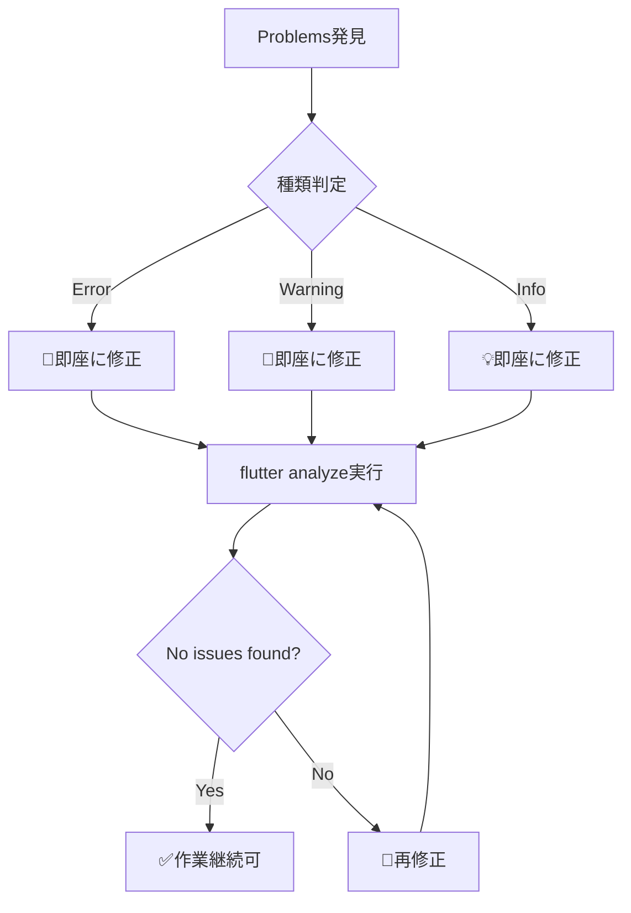

# 🚨 Problems撲滅ポリシー（強制遵守）

## 🎯 **絶対原則**

### **💀 PROBLEMS ZERO OR DIE RULE**
**いかなる作業においても、Problemsが1個でも残った状態での作業終了・移行は絶対禁止**

---

## 📏 **強制遵守事項**

### 1. **作業開始前チェック**（MUST）

```bash
# 必須実行コマンド
flutter analyze --no-pub
```

**結果が `No issues found!` でない場合**
- ❌ **作業開始禁止**
- 🔄 **既存Problems解決が最優先**

### 2. **作業中チェック**（ファイル保存時）

**任意のファイル編集後**
```bash
# ファイル編集の度に実行
flutter analyze --no-pub
```

**新しいProblemsが発生した場合**
- ⏸️ **即座に作業停止**
- 🛠️ **発生したProblemsの即時解決**
- ✅ **解決確認後に作業再開**

### 3. **作業完了前チェック**（CRITICAL）

**どんな作業でも、完了宣言前に必須実行**

```bash
# 【必須】完了前チェックリスト
echo "=== Problems撲滅チェック ==="
flutter analyze --no-pub
echo "=== 結果確認 ==="
# 必ず「No issues found!」を確認
```

**`No issues found!` 以外の結果が出た場合**
- 🚫 **作業完了宣言禁止**  
- 🔄 **全Problems解決まで作業継続**
- 📋 **完了条件は`No issues found!`のみ**

---

## ⚡ **即時対応ルール**

### **Problems発生時の対応フロー**



### **絶対禁止行為**

```markdown
❌ 「後で直そう」
❌ 「動くからいいや」  
❌ 「小さいWarningだから」
❌ 「時間がないから」
❌ 「次のタスクを先に」
```

**全てのProblemsは即座に解決**

---

## 🔧 **Problems種別対応ガイド**

### **Error** 🚨
- **処理**: 即座に修正（作業ブロッカー）
- **優先度**: 最高（他の作業停止）
- **対応時間**: 即時

### **Warning** 🔶  
- **処理**: 即座に修正（品質問題）
- **優先度**: 高（品質低下防止）
- **対応時間**: 即時

### **Info** 💡
- **処理**: 即座に修正（改善事項）
- **優先度**: 中（技術負債防止）
- **対応時間**: 即時

**例外なし。全てのProblemsを即座に解決。**

---

## 📋 **標準作業フロー**

### **任意作業の標準手順**

```bash
# 1. 作業開始前チェック（必須）
flutter analyze --no-pub
# 結果: "No issues found!" を確認

# 2. 実際の作業実施
# （ファイル編集、機能追加など）

# 3. ファイル保存の度にチェック
flutter analyze --no-pub

# 4. Problems発生時は即座に修正
# 修正 → flutter analyze → "No issues found!" まで繰り返し

# 5. 作業完了前の最終チェック（必須）
echo "=== 最終Problems確認 ==="
flutter analyze --no-pub
echo "=== 必ず 'No issues found!' を確認 ==="

# 6. "No issues found!" 確認後に作業完了宣言
```

---

## 💪 **自動化とツール活用**

### **VS Code設定強化**

`.vscode/settings.json` で即座にProblems表示：

```json
{
  "problems.decorations.enabled": true,
  "problems.showNearbyProblems": "allFilesInFolder",
  "dart.showTodos": false,
  "editor.formatOnSave": true,
  "dart.lineLength": 120,
  "editor.rulers": [120],
  "files.autoSave": "onFocusChange"
}
```

### **analysis_options.yaml 厳格化**

```yaml
analyzer:
  exclude:
    - build/**
  errors:
    # 全warnings をerror level に昇格
    avoid_print: error
    prefer_const_constructors: error
    unused_import: error
    unused_field: error
    unnecessary_brace_in_string_interps: error
    depend_on_referenced_packages: error
    avoid_relative_lib_imports: error
```

---

## 🏆 **遵守確認方法**

### **作業報告時の必須記載**

```markdown
## ✅ Problems撲滅確認

### 作業開始前
```
$ flutter analyze --no-pub
No issues found! (ran in X.Xs)
```

### 作業完了後
```
$ flutter analyze --no-pub  
No issues found! (ran in X.Xs)
```

### 解決したProblems
- [修正内容1]: エラーの詳細と解決方法
- [修正内容2]: 警告の詳細と解決方法

**Problems総数: 0個 ✅**
```

---

## 🎯 **このポリシーの効果**

### **技術的効果**
- 🔥 **技術負債の蓄積防止**
- 🚀 **コード品質の継続向上**  
- 💎 **リファクタリング効率の向上**
- 🛡️ **バグ発生率の大幅削減**

### **開発効率への効果**
- ⚡ **デバッグ時間の短縮**
- 📊 **Problems調査時間の削減**
- 🎯 **焦点を絞った開発**
- 🤝 **チーム開発の円滑化**

---

## ⚠️ **重要事項**

### **このポリシーは絶対遵守**

- 📜 **例外なし**
- 🔄 **全作業に適用**  
- 🚨 **違反は作業やり直し**
- ✅ **Problems 0 が完了の定義**

**「動くからいい」は通用しない。「No issues found!」が全ての基準。**

---

*Problems撲滅ポリシー v1.0*  
*制定日: 2025年8月4日*  
*適用開始: 即時*
