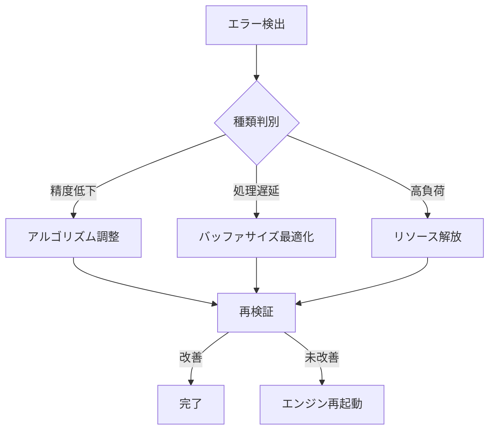

# エラーハンドリングフロー定義書

## 🎯 概要

このドキュメントは、伊勢節カラオケアプリケーションにおける異常系シナリオとその対応フローを定義します。

## 🚨 音声処理エラー

### 1. ピッチ検出エラー

#### 症状
- 検出精度が90%以下に低下
- 処理遅延が200ms以上に増加
- CPU使用率が50%以上に上昇

#### 対応フロー


### 2. 音声ファイル読み込みエラー

#### 症状
- ファイル破損
- フォーマット不一致
- メモリ不足

#### 対応フロー
1. 自動リトライ（最大3回）
2. フォーマット変換試行
3. メモリ解放処理
4. ユーザーへのエラー通知

## 🔄 リカバリー手順

### 即時リカバリー
```dart
try {
  await audioProcessor.recover();
  DebugLogger.info('リカバリー成功');
} catch (e) {
  await emergencyShutdown();
  DebugLogger.error('緊急シャットダウン実行', e);
}
```

### 段階的リカバリー
1. 不要リソースの解放
2. キャッシュのクリア
3. サブシステムの再起動
4. 完全再起動（最終手段）

## 🛡️ 予防措置

### メモリ監視
- 使用量が80%を超えた場合の警告
- 90%でガベージコレクション強制実行
- 95%で非重要処理の一時停止

### パフォーマンス監視
- CPU使用率の継続的監視
- バッファサイズの動的調整
- 処理キューの管理

## 📝 エラーログ管理

### ログレベル定義
- **FATAL**: システム停止レベル
- **ERROR**: 機能停止レベル
- **WARN**: 性能低下レベル
- **INFO**: 状態変化通知
- **DEBUG**: 詳細情報

### ログ出力例
```dart
void handleAudioError(Exception e) {
  _logger.error('音声処理エラー', e, StackTrace.current);
  CopilotDebugBridge.reportError('AudioProcessor', e.toString());
}
```

## ⚡ 緊急時の一時的例外処理

### 条件
- サービス継続が最優先の場合
- 一時的なパフォーマンス低下が許容される場合
- データ損失のリスクが無い場合

### 手順
1. 例外処理の申請
2. 技術リード/チームリードの承認
3. 一時的な対応実装
4. モニタリング強化
5. 恒久的な解決策の実装

---

*Version: 1.0.0*  
*最終更新: 2025年11月8日*